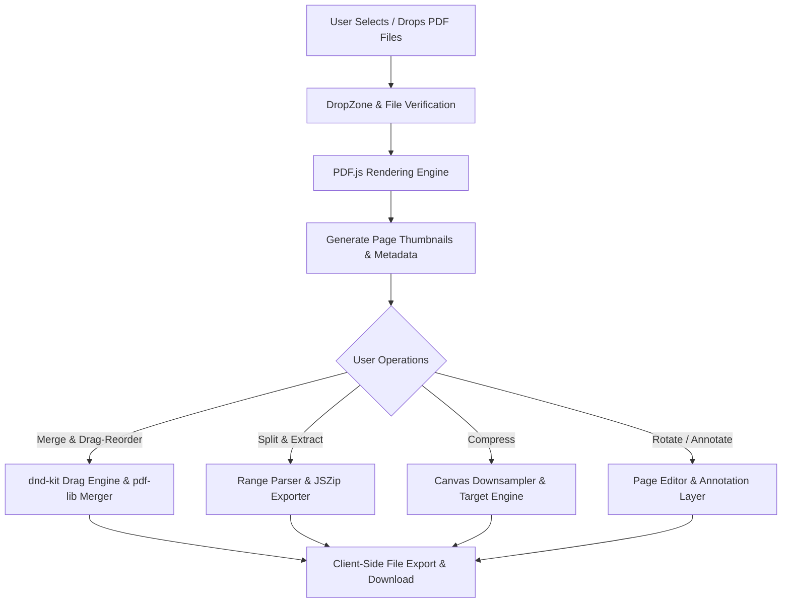

# 📄 Advanced PDF Editor & Toolkit

[](https://react.dev/)
[](https://vitejs.dev/)
[](https://tailwindcss.com/)
[](https://pdf-lib.js.org/)
[](https://web.dev/progressive-web-apps/)
[](LICENSE)

> A modern, high-performance, **100% client-side** PDF manipulation suite built with React 19, Vite, Tailwind CSS, `pdf-lib`, and `pdfjs-dist`. Process, merge, split, reorder, rotate, compress, and edit PDF documents locally in your browser with complete privacy and zero server latency.

---

## ✨ Features

- **🔒 100% Local & Secure (Privacy First)**All operations run entirely in the browser using WebAssembly / JavaScript PDF engines. Your sensitive documents never leave your machine.
- **🧩 PDF Merging & Reordering**Combine multiple PDF documents into a single file. Smooth drag-and-drop page reordering powered by `@dnd-kit`.
- **✂️ Advanced Splitting & Extraction**Split PDFs into custom page ranges, fixed page blocks, or individual pages. Export extracted pages directly or as a compressed `.zip` bundle using `JSZip`.
- **🗜️ Smart PDF Compression Engine**Reduce file sizes using adaptive canvas downsampling, color space reduction, and target size estimation with worker thread support.
- **🔄 Page Rotation & Management**Rotate individual pages in 90° increments, re-arrange thumbnails visually, or delete unnecessary pages before saving.
- **✏️ Interactive Visual Editor & Annotations**Render high-fidelity page previews with PDF.js and draw/annotate directly onto pages.
- **⚡ Progressive Web App (PWA)**Installable desktop/mobile experience with offline access enabled by `vite-plugin-pwa`.
- **🎨 Modern Dynamic UI**
  Sleek glassmorphism dark/light aesthetic designed with Tailwind CSS, Framer Motion animations, and custom typography (Outfit).

---

## 🛠️ Tech Stack & Dependencies

### Core Framework & Build Tool

- **Framework**: [React 19](https://react.dev/)
- **Build Tool**: [Vite 7](https://vitejs.dev/)
- **Language**: JavaScript (ES Next) / JSX

### PDF Processing Engines

- **[pdf-lib](https://pdf-lib.js.org/)**: Pure JavaScript PDF creation, merging, splitting, and low-level byte manipulation.
- **[pdfjs-dist (PDF.js)](https://mozilla.github.io/pdf.js/)**: High-speed canvas-based PDF rendering engine for accurate page preview generation.

### UI & Drag and Drop

- **Styling**: [Tailwind CSS 3](https://tailwindcss.com/)
- **Animations**: [Framer Motion](https://www.framer.com/motion/)
- **Icons**: [Lucide React](https://lucide.dev/)
- **Drag & Drop**: [`@dnd-kit/core`](https://dndkit.com/), `@dnd-kit/sortable`, `@dnd-kit/utilities`

### Utilities & Progressive Web App

- **Compression & Archiving**: [JSZip](https://stuk.github.io/jszip/)
- **Offline / PWA**: [Vite Plugin PWA](https://vite-pwa-org.netlify.app/)

---

## 🚀 Getting Started

### Prerequisites

Make sure you have Node.js installed on your machine:

- **Node.js**: `v18.0.0` or higher
- **npm**: `v9.0.0` or higher

### Installation

1. **Clone the repository**:

   ```bash
   git clone https://github.com/Govind-Madhav/Pdf-editor.git
   cd Pdf-editor
   ```
2. **Install dependencies**:

   ```bash
   npm install
   ```
3. **Start the development server**:

   ```bash
   npm run dev
   ```

   Open your browser and navigate to `http://localhost:5173`.

### Building for Production

To generate an optimized production bundle:

```bash
npm run build
```

Preview the production build locally:

```bash
npm run preview
```

---

## 🏗️ Architecture & Processing Workflow



---

## 🌟 Portfolio Highlights

- **Zero Backend Dependency**: Highlights full frontend capability in handling binary data, ArrayBuffers, and web workers.
- **Complex UI State Management**: Demonstrates responsive drag-and-drop list management and canvas interaction.
- **PWA Capabilities**: Showcases modern web standards including offline caching and standalone app installability.

---

## 📜 License

Distributed under the MIT License. See `LICENSE` for details.

---

<p align="center">
  Crafted with ❤️ by <a href="https://github.com/Govind-Madhav">Govind Madhav</a>
</p>
